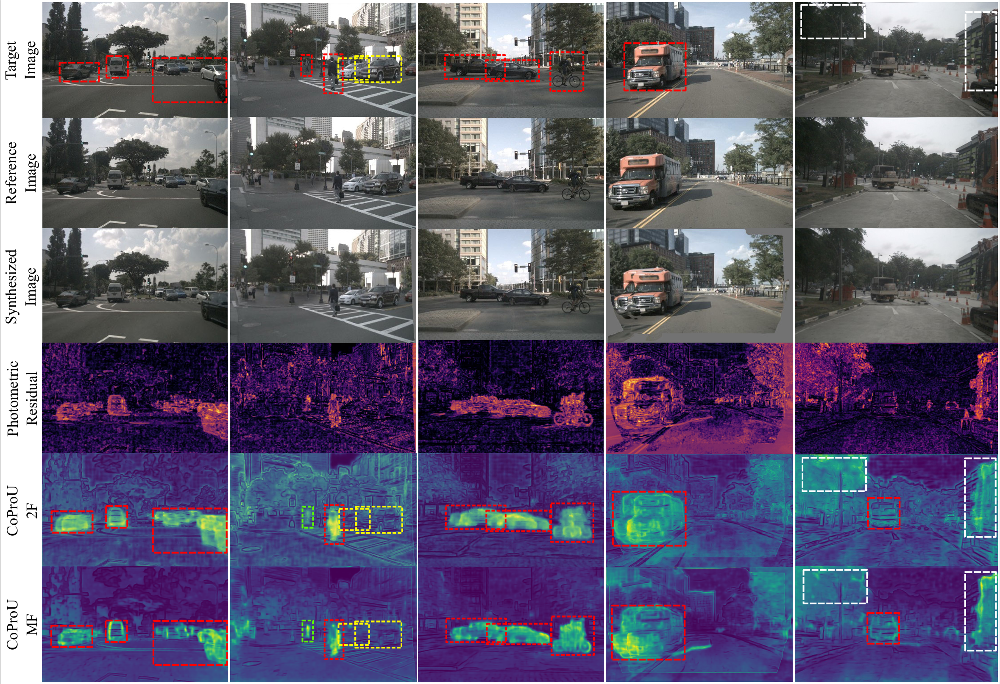
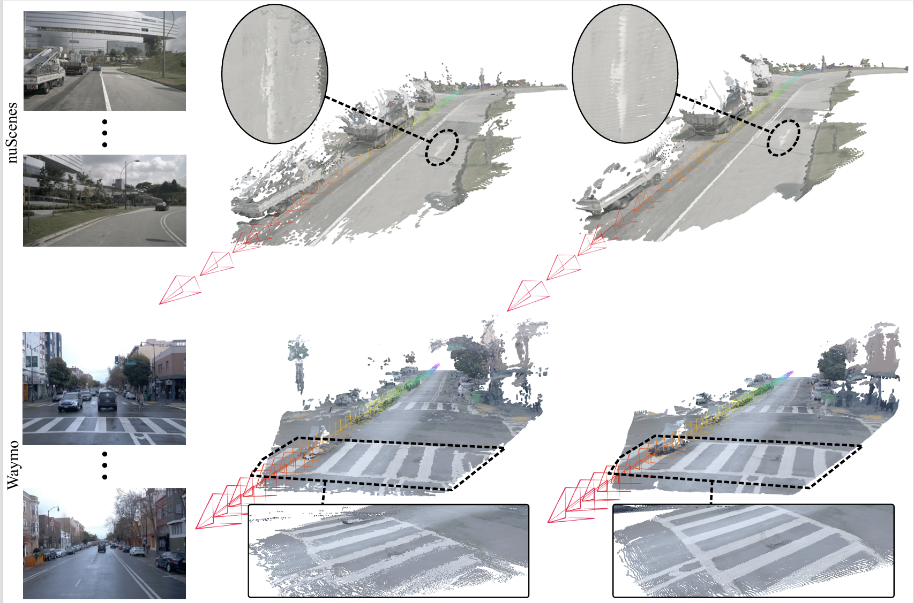

<div align="center">

# 🌟 CoProU-VO: Combined Projected Uncertainty for Visual Odometry

<br/>

> **Welcome!** This repository hosts the official implementations of our work on self-supervised visual odometry. We provide two versions corresponding to our publications:

<table align="center" style="margin: 0px auto;">
  <tr>
    <td align="center" width="50%">
      <b>📄 IJCV 2026 (Extended Multi-Frame)</b><br>
      <i>Combining Projected Uncertainty for Self-Supervised Visual Odometry: From Two-Frame to Multi-Frame</i><br><br>
      👉 <b>You are currently viewing this version.</b><br>
      <a href="https://github.com/Jchao-Xie/CoProU/tree/main"><code>[View main Branch]</code></a>
    </td>
    <td align="center" width="50%">
      <b>📄 GCPR 2025 (Original Two-Frame)</b><br>
      <i>CoProU-VO: Combining Projected Uncertainty for End-to-End Unsupervised Monocular Visual Odometry</i><br><br>
      Switch to the <code>gcpr-2025</code> branch for this version.<br>
      <a href="https://github.com/Jchao-Xie/CoProU/tree/gcpr-2025"><code>[Switch to gcpr-2025 Branch]</code></a>
    </td>
  </tr>
</table>

<br/>

### **[Jingchao Xie](https://www.linkedin.com/in/jingchao-xie-16b724297)\***<sup>1,3</sup>, **[Oussema Dhaouadi](https://cvg.cit.tum.de/members/dhou)\***<sup>1,2,3</sup>†, **[Weirong Chen](https://wrchen530.github.io/)**<sup>1,3</sup>, **[Johannes Meier](https://cvg.cit.tum.de/members/mejo)**<sup>1,3</sup>, 
### **[Zuria Bauer](https://zuriabauer.com/)**<sup>2</sup>, **[Marc Pollefeys](https://cvg.ethz.ch/team/Prof-Dr-Marc-Pollefeys)**<sup>2,4</sup>，**[Daniel Cremers](https://cvg.cit.tum.de/members/cremers)**<sup>1,3</sup>

<sup>1</sup> [Computer Vision Group at Technical University of Munich (TUM)](https://cvg.cit.tum.de/)  
<sup>2</sup> [ETH Zurich](https://cvg.ethz.ch/)
<sup>3</sup> [Munich Center for Machine Learning (MCML)](https://mcml.ai)
<sup>4</sup> [Microsoft](https://www.microsoft.com/en-us/research/lab/spatial-ai-zurich/)

\* Shared first authorship  † Corresponding author  

[](https://jchao-xie.github.io/CoProU/#ijcv)
[](https://link.springer.com/article/10.1007/s11263-026-02915-y)
</div>


## TL;DR

We present **Combined Projected Uncertainty (CoProU)** —  
a novel approach that robustly handles regions violating the static scene assumption within an unsupervised visual odometry framework.



**Figure**: Uncertainty maps in our CoProU-VO-2F and CoProU-VO-MF models detects dynamic objects (red boxes), as well as occlusions and reflections (white boxes) with high uncertainties and identifies static objects (yellow boxes) with low uncertainties. Green boxes highlight cases where CoProU-VO-MF assigns stronger uncertainty than CoProU-VO-2F, thanks to multi-frame geometric reasoning.  

## Preparation

### Environment

```bash
conda create -n coprou python=3.11
conda activate coprou

# Install PyTorch and torchaudio (version 2.7.0 with CUDA 11.8 support)
# ⚠️ Make sure to install the version that matches your local CUDA version.
# You can find other compatible versions at https://pytorch.org/get-started/previous-versions/
pip install torch==2.7.0+cu118 torchvision==0.22.0+cu118 torchaudio==2.7.0+cu118 --extra-index-url https://download.pytorch.org/whl/cu118

# We use xFormers==0.0.30. Make sure to install a version compatible with your installed PyTorch version.
pip install xformers==0.0.30 --extra-index-url https://download.pytorch.org/whl/cu118

# Install other required Python packages
pip install -r requirements.txt
```

### Datasets and Preprocessing

We trained and evaluated our model on two datasets:

- **[KITTI Odometry Dataset](https://www.cvlibs.net/datasets/kitti/eval_odometry.php)**  

- **[nuScenes Dataset](https://www.nuscenes.org/nuscenes#download)**  

- **[Waymo Open Dataset](https://waymo.com/intl/it/open/data/perception/)**  

Please download the datasets from the official links above and organize them under the `\storage` directory as follows:

```bash
\storage
  \KITTI_odometry
    \00
    \01
    ...
  \nuScenes
    \maps
    \samples
    \sweeps
    \v1.0-trainval
    ...
  \waymo_raw_data
    \training
      *.tfrecord
      ...
    \validation
      *.tfrecord
      ...
```
Please Use the following commands to preprocess the datasets.
#### KITTI Odometry
```bash
# No need to pre-process the KITTI Odometry
```

#### nuScenes
```bash
python data/nusc.py --config data/nuscenes_config/local_nusc.yaml
```

#### Waymo Open Dataset
```bash
# Create an environment for waymo data processing
conda create -n waymo python=3.9 -y
conda activate waymo

pip install waymo-open-dataset-tf-2-11-0==1.6.1 opencv-python-headless==4.7.0.72


# split-idx and split-num are used for parallel processing with multiple terminals
# training set
python data/waymo_preprocessing.py --data_dir storage/waymo_raw_data/training --out_root storage/waymo_original_size/waymo_original_size_train --split-idx 0 --split-num 1 --mode "processing" 

# validation set
python data/waymo_preprocessing.py --data_dir storage/waymo_raw_data/validation --out_root storage/waymo_original_size/waymo_original_size_val --split-idx 0 --split-num 1 --mode "processing" 

```

Processed data will be saved under folder `\storage`
### Checkpoints
Create folder `\checkpoints`,
```bash
mkdir -p checkpoints
```
and put the following checkpoints under the created folder.


#### Pre-trained ViTs 

In our CoProU-2F version, we used pretrained models.

Please download **[Depth-Anything-V2-Small](https://huggingface.co/depth-anything/Depth-Anything-V2-Small/resolve/main/depth_anything_v2_vits.pth?download=true)** and **[ViT-S/14 distilled](https://dl.fbaipublicfiles.com/dinov2/dinov2_vits14/dinov2_vits14_pretrain.pth)**


```bash
# Download Depth-Anything-V2-Small checkpoint
wget -O checkpoints/depth_anything_v2_vits.pth "https://huggingface.co/depth-anything/Depth-Anything-V2-Small/resolve/main/depth_anything_v2_vits.pth?download=true"

# Download ViT-S/14 distilled (DINOv2) checkpoint
wget -O checkpoints/dinov2_vits14_pretrain.pth "https://dl.fbaipublicfiles.com/dinov2/dinov2_vits14/dinov2_vits14_pretrain.pth"

```


#### CoProU-2F and CoProU-MF

We provide models trained on all three datasets in table 5.
```bash
# Download CoProU-MF checkpoints
gdown --folder "https://drive.google.com/drive/folders/1u1x2x0vpPgxPZd_CgtvvQsa6hcctfFSG?usp=drive_link" \
  -O checkpoints/CoProU-MF

# Download CoProU-2F checkpoints
gdown --folder "https://drive.google.com/drive/folders/10gg5vmUMJ-CIVrL-VWQrSzGc3dbPLJDa?usp=drive_link" \
  -O checkpoints/CoProU-2F

```


## Inference and Visualization

Once the dataset and checkpoint are prepared, inference on two consecutive images can be performed using the following command as an example:


### Point Cloud


```bash
# with --sequence-length, it can control the number of input images, which center at '--tgt-img'.
# the output of depth maps, uncertainty maps, and also reconstructed scene are saved under 'visualization_inference'
# To check the reconstructed point cloud interactively, please click the generated link from gradio after running following commands.

conda activate coprou

# Example for segment in KITTI
python inference/point_cloud.py --pretrained-model 'checkpoints/CoProU-MF/CoProU-MF.ckpt' --show-cam --tgt-img "storage/kitti_odometry/09/image_2/000807.png"  --sequence-length 95

# Example for segment in nuScenes
python inference/point_cloud.py --pretrained-model 'checkpoints/CoProU-MF/CoProU-MF.ckpt' --show-cam --tgt-img "storage/nuscenes_original_size/scene-0928_0/n015-2018-10-08-15-44-23+0800__CAM_FRONT__1538984994112460.jpg" --sequence-length 95

# Example for segment in waymo
python inference/point_cloud.py --pretrained-model 'checkpoints/CoProU-MF/CoProU-MF.ckpt' --show-cam --tgt-img "storage/waymo_original_size/waymo_original_size_val/segment-12496433400137459534_120_000_140_000_with_camera_labels/images/frame_0085.jpg" --sequence-length 95
```

Outputs, including depths, uncertainties, and synthesized image will be saved under `\visualization_inference`.


## Training


```bash
conda activate coprou
# Please change the --nproc_per_node according to your infra
# Training with 4 GPUs:
torchrun --nproc_per_node=4 train.py --config coprou_mf.yaml
```

#### Tensorboard and Checkpoints are saved under `\checkpoints`. 


## Evaluation

### Evaluation of our provided checkpoints

For CoProU-MF
```bash
CKPT_DIR='checkpoints/CoProU-MF/CoProU-MF.ckpt' bash script/evaluation.sh
```

For CoProU-2F
```bash
CKPT_DIR="checkpoints/CoProU-2F/CoProU-2F.ckpt" bash script/evaluation.sh
```


### Evaluation of your trained checkpoints

```bash
CKPT_DIR="path/to/your/checkpoint.ckpt" bash script/evaluation.sh
```

    
 ##  Acknowledgements 
 
We appreciate the contributions of the following projects, which have greatly supported our work:

 * [SfMLearner-Pytorch](https://github.com/ClementPinard/SfmLearner-Pytorch) - A pioneering framework for end-to-end monocular visual odometry.

 * [VGGT](https://github.com/facebookresearch/vggt) - The foundation of our codebase.

 * [SC-Depth](https://github.com/JiawangBian/sc_depth_pl) - Our baseline.
 
 * [Kitti-Odom-Eval-Python](https://github.com/Huangying-Zhan/kitti-odom-eval) - Python implementation for KITTI odometry evaluation.
 
 * [RoGS](https://github.com/fzhiheng/RoGS) - Preprocessing code for the nuScenes dataset.

 
 * [DepthAnything-v2](https://github.com/DepthAnything/Depth-Anything-V2) and [DINOv2](https://github.com/facebookresearch/dinov2) – Providing Vision Transformer backbone features.

 ## License

This project is licensed under the GNU General Public License v3.0.  
See the [LICENSE](./LICENSE) file for more details.

Parts of this repository are adapted from VGGT and are subject to the VGGT License. A copy of the VGGT License is provided in [VGGT_LICENSE](./third_party/VGGT_LICENSE.txt).

Third-party components retain their original licenses. Please check the corresponding license files and source repositories for details.

## If you find our work useful in your research, please consider citing our paper:
 
```bibtex
@inproceedings{xie2025coprou,
  title={CoProU-VO: Combining Projected Uncertainty for End-to-End Unsupervised Monocular Visual Odometry},
  author={Xie, Jingchao and Dhaouadi, Oussema and Chen, Weirong and Meier, Johannes and Kaiser, Jacques and Cremers, Daniel},
  booktitle={DAGM German Conference on Pattern Recognition},
  pages={502--517},
  year={2025},
  organization={Springer}
}
```
```bibtex
@article{xie2026combining,
  title     = {Combining Projected Uncertainty for Self-Supervised Visual Odometry: From Two-Frame to Multi-Frame},
  author    = {Xie, Jingchao and Dhaouadi, Oussema and Chen, Weirong and Meier, Johannes and Bauer, Zuria and Pollefeys, Marc and Cremers, Daniel},
  journal   = {International Journal of Computer Vision},
  volume    = {134},
  number    = {7},
  pages     = {330},
  year      = {2026},
  month     = {Jun},
  day       = {30},
  issn      = {1573-1405},
  doi       = {10.1007/s11263-026-02915-y},
  url       = {https://doi.org/10.1007/s11263-026-02915-y}
}
```
 
